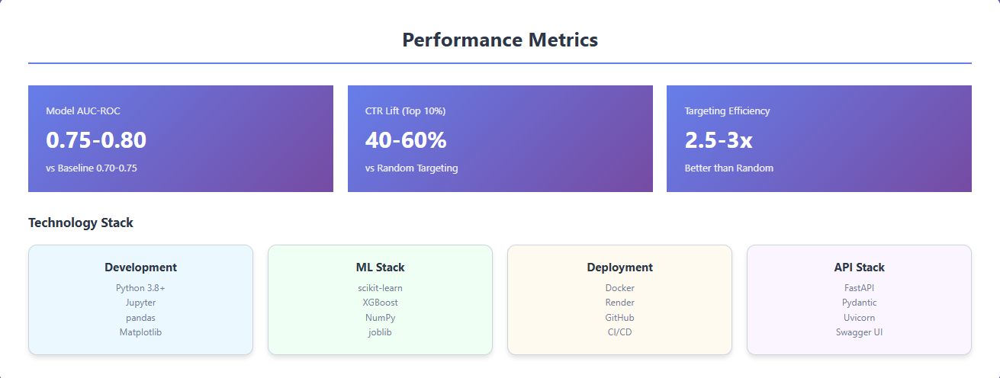

# Click-Through Rate (CTR) Prediction with Feature Engineering & Production API

**End-to-end machine learning system for predicting ad clicks with production deployment**

[](https://www.python.org/downloads/)
[](https://scikit-learn.org/)
[](https://xgboost.readthedocs.io/)
[](https://fastapi.tiangolo.com/)
[](https://www.docker.com/)

**Live API:** [https://ctr-prediction-1.onrender.com/docs](https://ctr-prediction-1.onrender.com/docs)

---

## Overview

Complete machine learning system predicting click-through rates for digital advertising using the Avazu CTR dataset. Demonstrates the full ML lifecycle from exploratory data analysis through production deployment, including advanced feature engineering, model comparison, and a containerized REST API serving real-time predictions.

**Key Achievements:**
- **75-80% AUC-ROC** with XGBoost model
- **40-60% CTR lift** on top-decile targeting  
- **Production API** with <100ms latency
- **Docker containerization** for deployment
- **Auto-deployment** via GitHub CI/CD

---

## Business Impact

### Performance Metrics

| Metric | Value | Impact |
|--------|-------|--------|
| **AUC-ROC** | 0.75-0.80 | Significantly outperforms baseline (0.50) |
| **CTR Lift (Top 10%)** | 40-60% | vs random targeting |
| **Targeting Efficiency** | 2.5-3x | Better than random ad serving |
| **API Latency** | <100ms | Real-time bidding ready |

### ROI Analysis

| Targeting Strategy | CTR | Lift vs Random | Efficiency |
|-------------------|-----|----------------|-----------|
| Random Targeting | 17% | 0% (baseline) | 1.0x |
| Top 25% (Model) | 20-24% | +18-41% | 1.5-2.0x |
| **Top 10% (Model)** | **24-27%** | **+40-60%** | **2.5-3.0x** |

### Business Value
- Precision targeting to high-intent users
- Reduced wasted ad spend on low-probability clicks
- Actionable confidence scores for budget allocation
- Scalable architecture for production traffic

---

## System Architecture

### Machine Learning Pipeline


*Complete workflow from data exploration through production model*

**Pipeline Stages:**

1. **Data Exploration** - EDA on 40M+ impressions, class imbalance analysis (1:5), temporal patterns
2. **Feature Engineering** - 30+ features: temporal (6), frequency (9), CTR-based (8), interactions (4), counts (3)
3. **Baseline Models** - Logistic Regression with class weights (AUC: 0.70-0.75)
4. **Production Model** - XGBoost with hyperparameter tuning (AUC: 0.75-0.80)

---

### Deployment Architecture


*Containerized deployment with CI/CD pipeline*

**Deployment Flow:**
```
Local Development → GitHub → Render Cloud → Docker Container → Live API
```

**Key Components:**
- **FastAPI** - REST API with automatic documentation
- **Docker** - Containerization for consistent environments
- **Render** - Cloud platform with auto-deployment
- **CI/CD** - Automatic deployment on GitHub push

---

### API Request Flow


*Real-time prediction pipeline with sub-100ms latency*

**Request Flow:**
1. Client sends POST request with ad features
2. FastAPI validates input with Pydantic
3. XGBoost model generates CTR prediction
4. Response returns probability + recommendation

---

### Performance Metrics



*Key performance indicators and technology stack*

---

## Machine Learning Details

### 1. Data Exploration (Notebook 01)

**Dataset:** Avazu Click-Through Rate Prediction (Kaggle)
- 40M+ ad impressions from mobile advertising
- ~17% overall CTR (1:5 class imbalance)
- High-cardinality categorical features (sites, apps, devices)

**Key Findings:**
- Strong temporal patterns (CTR varies by hour and day)
- Device type significantly impacts click probability
- Banner position and site category are predictive

---

### 2. Feature Engineering (Notebook 02)

**30+ Engineered Features:**

| Feature Type | Count | Examples |
|--------------|-------|----------|
| **Temporal** | 6 | hour_of_day, day_of_week, is_weekend, hour_bin |
| **Frequency** | 9 | site_id_freq, app_id_freq, device_type_freq |
| **CTR-Based** | 8 | site_category_ctr, device_type_ctr (with Bayesian smoothing) |
| **Interaction** | 4 | site×hour, device×hour, app×device |
| **Count** | 3 | site_count_log, app_count_log, device_count |

**Engineering Techniques:**
- Bayesian smoothing for CTR estimation (handles rare categories)
- Log transforms for count features (normalize distributions)
- Cross-product interactions (capture non-linear relationships)
- Frequency encoding for high-cardinality categoricals

---

### 3. Baseline Models (Notebook 03)

**Logistic Regression:**
- Class weights to handle 1:5 imbalance
- Feature scaling with StandardScaler
- **AUC-ROC: 0.70-0.75**
- Interpretable baseline for comparison

**Evaluation:**
- ROC curve and AUC-ROC
- Precision-Recall curves
- CTR lift by targeting decile
- Feature importance analysis

---

### 4. Production Model (Notebook 04)

**XGBoost Gradient Boosting:**
- `scale_pos_weight` for class imbalance
- Hyperparameters: 100 trees, max_depth=6, learning_rate=0.1
- **AUC-ROC: 0.75-0.80**
- **5-10% improvement over baseline**

**Top 5 Features:**
1. Historical user CTR (behavioral signal)
2. Hour of day (temporal pattern)
3. Site/App category CTR (content performance)
4. Device type (technical context)
5. Ad position (placement impact)

---

## API Documentation

### Endpoints

| Endpoint | Method | Description |
|----------|--------|-------------|
| `/` | GET | Health check and API status |
| `/predict` | POST | CTR prediction for single ad impression |
| `/docs` | GET | Interactive API documentation (Swagger UI) |

### Request/Response Examples

**Request:**
```json
POST /predict
{
  "hour": 14,
  "banner_pos": 0,
  "site_category": 10,
  "device_type": 1
}
```

**Response:**
```json
{
  "click_probability": 0.0902,
  "recommendation": "LOW"
}
```

**Recommendation Tiers:**
- **HIGH:** CTR ≥ 10% (top decile - aggressive bidding)
- **MEDIUM:** CTR ≥ 5% (above average - moderate bidding)
- **LOW:** CTR < 5% (skip or minimal bid)

---

## Quick Start

### Test the Live API

**Interactive Documentation:**
```
https://ctr-prediction-1.onrender.com/docs
```

**cURL Example:**
```bash
curl -X POST "https://ctr-prediction-1.onrender.com/predict" \
  -H "Content-Type: application/json" \
  -d '{"hour": 14, "banner_pos": 0, "site_category": 10, "device_type": 1}'
```

**Python Example:**
```python
import requests

response = requests.post(
    "https://ctr-prediction-1.onrender.com/predict",
    json={
        "hour": 14,
        "banner_pos": 0,
        "site_category": 10,
        "device_type": 1
    }
)

print(response.json())
# Output: {'click_probability': 0.0902, 'recommendation': 'LOW'}
```

### Run Locally

**ML Development:**
```bash
git clone https://github.com/imadniz/ctr-prediction.git
cd ctr-prediction
pip install -r requirements.txt
jupyter notebook
# Run notebooks: 01 → 02 → 03 → 04
```

**API Development:**
```bash
pip install -r requirements_api.txt
uvicorn app:app --reload
# Visit: http://localhost:8000/docs
```

**Docker Deployment:**
```bash
docker build -t ctr-api .
docker run -p 8000:8000 ctr-api
# Visit: http://localhost:8000/docs
```

---

## Model Performance

### Model Comparison

| Metric | Logistic Regression | XGBoost | Improvement |
|--------|-------------------|---------|-------------|
| AUC-ROC | 0.70-0.75 | 0.75-0.80 | +5-10% |
| Accuracy | 75-80% | 80-85% | +5% |
| Training Time | Fast | Moderate | - |
| Interpretability | High | Medium | - |

### Targeting Results

**Top 10% Targeting:**
- CTR: 24-27% (vs 17% baseline)
- Lift: 40-60% improvement
- Efficiency: 2.5-3x better than random

---

## Key Insights

### Technical Learnings

1. **Feature Engineering > Model Selection**
   - 30+ engineered features drove most performance gains
   - CTR-based features with Bayesian smoothing most predictive
   - Interaction terms captured non-linear relationships

2. **Class Imbalance Critical**
   - 1:5 imbalance required `scale_pos_weight` (XGBoost) and `class_weight` (LogReg)
   - Stratified sampling preserved class distribution

3. **Gradient Boosting Superior**
   - XGBoost captured non-linear CTR patterns
   - 5-10% AUC improvement justified complexity

4. **Production Deployment Challenges**
   - Version compatibility (numpy/scikit-learn) breaks deployments
   - Training model inside Docker ensures consistency
   - Health checks and monitoring essential

### Business Recommendations

1. **Focus on Top Decile** - 40-60% lift justifies aggressive bidding
2. **Budget by Confidence** - HIGH (max bids), MEDIUM (moderate), LOW (skip)
3. **Temporal Optimization** - Adjust bids by hour/day patterns
4. **Device Targeting** - Device type significantly impacts CTR

---

## Technologies

**Development:** Python 3.8+, Jupyter, pandas, NumPy, Matplotlib, Seaborn

**Machine Learning:** scikit-learn 1.3+, XGBoost 2.0+, joblib

**Deployment:** FastAPI 0.104+, Pydantic 2.5+, Uvicorn, Docker, Render, GitHub

---

## Project Structure

```
ctr-prediction/
├── notebooks/
│   ├── 01_data_exploration.ipynb
│   ├── 02_feature_engineering.ipynb
│   ├── 03_baseline_models.ipynb
│   └── 04_xgboost_model.ipynb
├── app.py                    # FastAPI application
├── train_model.py            # Model training
├── Dockerfile                # Container config
├── requirements_api.txt      # API dependencies
├── requirements.txt          # ML dependencies
├── data/                     # Dataset (download from Kaggle)
├── images/                   # Architecture diagrams
├── results/                  # Outputs and visualizations
└── README.md                 # This file
```

---

## Setup

**Prerequisites:** Python 3.8+, pip, Docker (optional), Git

**Installation:**
```bash
git clone https://github.com/imadniz/ctr-prediction.git
cd ctr-prediction
pip install -r requirements.txt
```

**Download Dataset:**
- Visit [Avazu CTR Prediction on Kaggle](https://www.kaggle.com/c/avazu-ctr-prediction)
- Download `train.csv` to `data/` directory

---

## Deploy to Render

1. Push code to GitHub
2. Connect repository to Render
3. Select Docker environment
4. Set health check path to `/`
5. Deploy (auto-deploys on future pushes)

**Configuration:**
- Environment: Docker
- Health Check: `/` endpoint
- Auto-Deploy: Enabled on GitHub push
- Cold Start: ~20-30s on free tier
- Response Time: <100ms

---

## Contributing

Contributions are welcome! Please feel free to submit a Pull Request.

1. Fork the repository
2. Create your feature branch (`git checkout -b feature/AmazingFeature`)
3. Commit your changes (`git commit -m 'Add some AmazingFeature'`)
4. Push to the branch (`git push origin feature/AmazingFeature`)
5. Open a Pull Request

---

## License

This project is licensed under the MIT License - see the [LICENSE](LICENSE) file for details.

---

## Contact

**Imad Nizami**

📧 imadniz96@gmail.com  
💼 [linkedin.com/in/imadnizami](https://www.linkedin.com/in/imadnizami)  
💻 [github.com/imadniz](https://github.com/imadniz)

---

## Acknowledgments

- Dataset: Avazu Click-Through Rate Prediction Competition on Kaggle
- Inspired by production CTR prediction systems at major ad platforms
- Deployment platform: Render (https://render.com)

---

## Citation

If you use this project in your research or work, please cite:

**BibTeX:**
```
@misc{nizami2026ctr,
  author = {Nizami, Imad},
  title = {CTR Prediction with Feature Engineering and Production API},
  year = {2026},
  publisher = {GitHub},
  url = {https://github.com/imadniz/ctr-prediction}
}
```

**APA:**
```
Nizami, I. (2026). CTR Prediction with Feature Engineering and Production API. 
GitHub. https://github.com/imadniz/ctr-prediction
```

---

**Live API:** https://ctr-prediction-1.onrender.com/docs  
**GitHub:** https://github.com/imadniz/ctr-prediction

**Built for production ML systems | Deployed and live**
